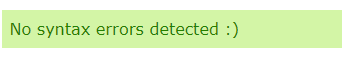

# Battleships Game

## Table of Contents
1. [User Experience](#user-experience)
   - [User Stories](#user-stories)
2. [Installation](#installation)
3. [Design](#design)
   - [Colors](#colors)
   - [Design Inspiration](#design-inspiration)
4. [Features](#features)
   - [Gameplay](#gameplay)
5. [Technologies Used](#technologies-used)
6. [Testing](#testing)
   - [User Testing](#user-testing)
7. [Bugs/Issues](#bugsissues)
   - [Fixed](#fixed)
   - [Unfixed](#unfixed)
8. [Deployment](#deployment)
9. [Credits](#credits)
   - [Design](#design)
   - [Python](#python)
10. [Acknowledgements](#acknowledgements)

## User Experience

### User Stories
- As a player, I want to understand the rules of the game.
- I want an interactive and engaging gaming experience.
- I want clear feedback on my moves.
- I want it to be clear which player is me and which is my opponent.

## Installation
- Clone the repository: `git clone https://github.com/KittyDig/Portfolio3`
- Navigate to the project directory: `cd Portfolio3`
- Run the game: `python run.py`

## Design

### Colors

### Design Inspiration
- The design was inspired by classic Battleships games with a focus on simplicity and clarity for the player.

## Features

### Gameplay
- Players take turns guessing coordinates to attack the opponent's fleet.
- 'X' represents a hit, 'O' represents a miss.
- The first player to sink all opponent's ships wins.

## Technologies Used
- Python

## Testing

### User Testing
- Gathered feedback from friends and family for testing the game to see if it was both enjoyable and easy to understand.

### Validator
- Used the website https://extendsclass.com/python-tester.html to validate my code, and it found no syntax errors.

## Bugs/Issues

### Fixed

### Unfixed

## Deployment

## Credits

### Design

### Python

## Acknowledgements
