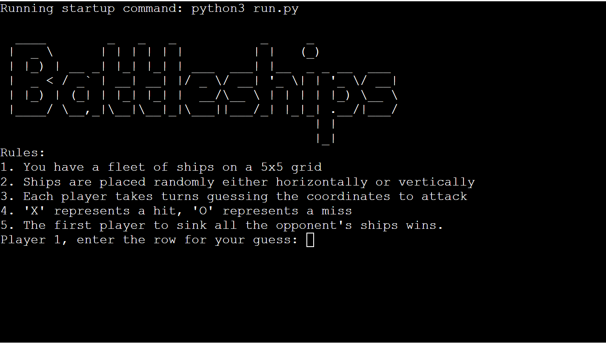

# Battleships Game

This is a take on the classic game 'Battleships' made entirely with python. It is a command line game that can be played with two players or against a computer, which was deployed using Heroku.

The live site can be found [here](https://portfolio3-battleships-225355a434d1.herokuapp.com/).

## Table of Contents

1. [User Experience](#user-experience)
   - [User Stories](#user-stories)
2. [Installation](#installation)
3. [Design](#design)
   - [Logo](#logo)
   - [Colours](#colours)
   - [Design Inspiration](#design-inspiration)
4. [Features](#features)
   - [Gameplay](#gameplay)
5. [Technologies Used](#technologies-used)
6. [Testing](#testing)
   - [Manual Testing](#manual-testing)
   - [User Testing](#user-testing)
7. [Bugs/Issues](#bugsissues)
   - [Fixed](#fixed)
   - [Unfixed](#unfixed)
8. [Future Development](#future-development)
9. [Deployment](#deployment)
10. [Credits](#credits)

- [Design](#design)
- [Python](#python)

10. [Acknowledgements](#acknowledgements)

## User Experience

This section focuses on the UX process with the player in mind, to help understand the processes that went into creating this game to make it as user-friendly as possible.

Project goals:

- To make an interactive and user-friendly command line game.
- To provide a game that suits players of any level.
- To create a positive gaming experience.

### User Stories

- As a player, I want to understand the rules of the game.
- I want an interactive and engaging gaming experience.
- I want clear feedback on my moves.
- I want it to be clear which player is me and which is my opponent.
- I want the game to be easily playable by a gamer of any level.

## Installation

- Clone the repository: `git clone https://github.com/KittyDig/Portfolio3`
- Navigate to the project directory: `cd Portfolio3`
- Run the game: `python run.py`

## Design

### Logo

- I used [this](https://patorjk.com/software/taag/#p=display&f=Big&t=Battleships) website to generate ascii art for the logo for the game to make it stand out visually.
- I took inspiration from old video game titles.

### Colours

- I used red and a blue colour to differentiate between the two players boards.
- I used these colours as they are colours which are easily recognisable to mean opposite players, as most games utilise red and blue for this purpose.

### Design Inspiration

- The design was inspired by classic Battleships games with a focus on simplicity and clarity for the player.
- By using two different colours for the two boards adds clarity to the game for the players.

## Features

### Gameplay

- Players take turns guessing coordinates to attack the opponent's fleet.
- 'X' represents a hit, 'O' represents a miss.
- The first player to sink all opponent's ships wins.
- Player 1 goes first, they are asked to give the row and column of their guess.
- If the player gives a guess that is not a valid response, they are informed of this, and are told to give a different answer.
- If the player hits the other player's ships and manages to sink them both, this player wins.

### Player Options

- Players have the option to play against another human or against the computer.
- When starting the game, the player is prompted to choose their opponent, either a human player or the computer.
- If the player chooses to play against the computer, the computer will make random guesses for its turns.

## Technologies Used

- Python for creating the game.
- Heroku for deploying the app.

## Testing

### Manual Testing

- I put the code through PEP8 linter and received minimal issues.
- Tested putting in invalid inputs and received the correct errors, whether it was incorrect type of input or a number not on the board.
- I tested the terminal on Gitpod and the Heroku deployed app.

### User Testing

- Gathered feedback from friends and family for testing the game to see if it was both enjoyable and easy to understand.
- Resolved an issue with board size, it was too big, based on user testing, the game was too large to be enjoyable for a quick game.
- Added numbers to the board so the user can easily tell which rows and columns have been hit to prevent repeat attacks.

### Validator

- Used the website https://extendsclass.com/python-tester.html to validate my code, and it found no syntax errors.

## Bugs/Issues

### Fixed

- Resolved an issue with the board size, the game counted 0 as a viable section of the board, which was not correct. This was fixed by using row -= 1 col -= 1 to zero index the board.
- Resolved an issue with valid inputs, the game would crash whenever a user would either put a space or a non-numerical input as a turn. This was fixed by updating the player.py code to include a catch that gives the player an error if they try to input any value that is not on the board.

### Unfixed

- No known issues at the moment.

## Future Development

- I would like to be able to attach a google sheets to this project to be able to allow the players to enter their names so they can keep track of the scores.

## Deployment

- The game can be run locally by following the installation steps:
- Clone the repository: `git clone https://github.com/KittyDig/Portfolio3`
- Navigate to the project directory: `cd Portfolio3`
- Run the game: `python run.py`

- The game can be run on Heroku by:
   - Cloning the repository.
   - Creating a new Heroku app
   - Setting the buildpacks to Python and NodeJS in that order.
   - Linking the repository to the app.
   - Clicking on deploy.

## Credits

### Design

- For the design, I used https://stackoverflow.com/questions/287871/how-do-i-print-colored-text-to-the-terminal to help me understand how to add colour to the game.
- The design is basic, with one board red for one player, and one board blue for another player.

### Python

- Thanks to the open-source battleships projects that helped me to understand the main concepts of the game:
  - [GitHub - gbrough Python Battleship Game](https://github.com/gbrough/battleship/blob/main/single_player.py) with accompanying video: [YouTube](https://www.youtube.com/watch?app=desktop&v=tF1WRCrd_HQ)
  - [Codecademy Forum - cloud2236863496](https://discuss.codecademy.com/t/excellent-battleship-game-written-in-python/430605)
  - [Code Review Stack Exchange - Haliax](https://codereview.stackexchange.com/questions/232013/a-simple-battleship-game)
  - [Pythondex - Jarvis Silva](https://pythondex.com/python-battleship-game)
  - [Bigmonty12 - Austin Montgomery, Avery Smith](https://bigmonty12.github.io/battleship)
  - [Stack Overflow - joeld, Peter Mortensen](https://stackoverflow.com/questions/287871/how-do-i-print-colored-text-to-the-terminal)

## Acknowledgements

- Thank you to my mentor Spencer for all of the guidance and help with this project!
